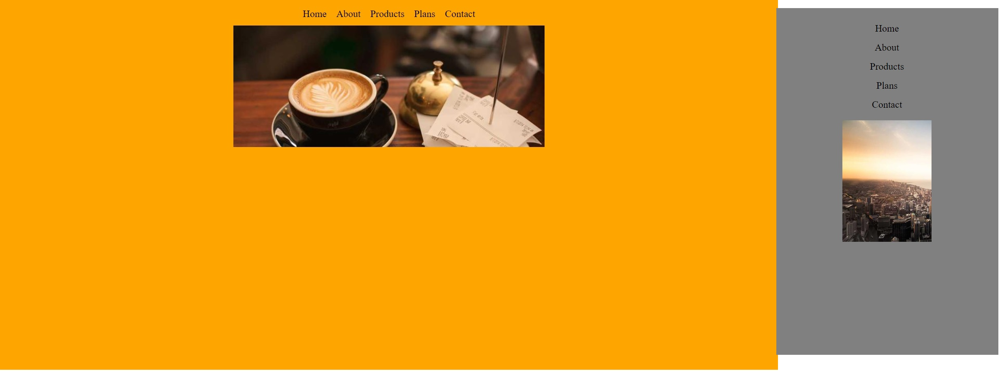

# Media Query Web Application

A simple web application to demonstrate the use of media queries for responsive design.

## Features
- Changes background color and image based on screen width
- Responsive navigation menu
- Different styles for various screen sizes

## Technologies
- HTML
- CSS

# Medya Sorgulama Web Uygulaması

Duyarlı tasarım için medya sorgularının kullanımını gösteren basit bir web uygulaması.

## Özellikler
- Ekran genişliğine göre arka plan rengini ve resmini değiştirir
- Duyarlı gezinme menüsü
- Çeşitli ekran boyutları için farklı stiller

## Teknolojiler
- HTML
- CSS

[Canlı Demo'yu Deneyin](https://fatihycan.github.io/query-media/)
